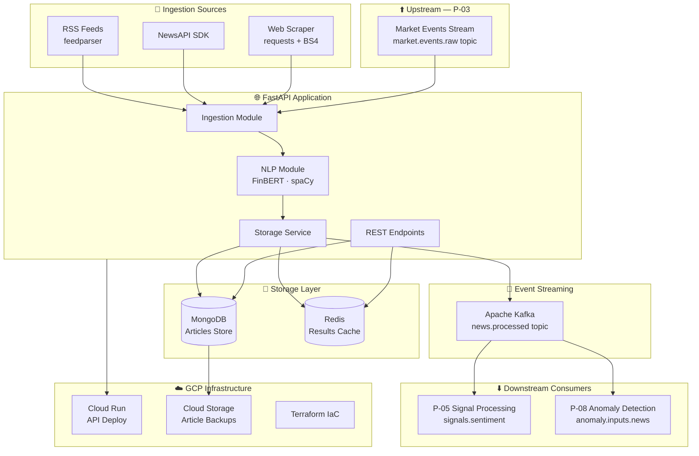

# Financial News Intelligence API (P-04)

> **Status**: 🚧 Day 0 — Scaffolding & Setup  
> **Branch**: `feature/day-0-setup`  
> **Stack**: FastAPI · MongoDB · Redis · Apache Kafka · spaCy · FinBERT · Docker · GCP · Terraform

---

## Overview

A production-grade REST API that ingests financial news in real time from multiple sources (RSS feeds, NewsAPI, web scraping), applies NLP processing (sentiment classification via FinBERT, named entity recognition for financial entities), and exposes the enriched results through standardized REST endpoints.

The system stores processed articles in **MongoDB**, caches recent results in **Redis**, and publishes `news.processed` events to **Apache Kafka** to feed downstream portfolio projects (P-05 Signal Processing, P-08 Anomaly Detection).

---

## Architecture



---

## Tech Stack

| Layer | Technology | Purpose |
|---|---|---|
| **API Framework** | FastAPI + Uvicorn | REST endpoints, async request handling |
| **Ingestion** | feedparser, NewsAPI SDK, requests + BeautifulSoup | Multi-source news ingestion |
| **NLP** | FinBERT (HuggingFace), spaCy `en_core_web_sm` | Sentiment classification, NER |
| **Document Store** | MongoDB 7.0 | Persisting processed articles |
| **Cache** | Redis 7.2 | Short-lived results & deduplication |
| **Messaging** | Apache Kafka (Confluent) | Event streaming (`news.processed`) |
| **Containerization** | Docker + Docker Compose | Local development & service orchestration |
| **IaC** | Terraform | GCP resource provisioning |
| **Cloud** | GCP Cloud Run + GCS | API deployment + backups |
| **CI/CD** | GitHub Actions | Lint → Test → Build → Deploy pipeline |
| **Testing** | pytest + httpx + pytest-asyncio | Unit & integration tests (80%+ coverage) |
| **Code Quality** | Ruff (lint/format) + MyPy (type checking) | Static analysis |

---

## Project Structure

```
financial-news-intelligence-api/
├── src/
│   ├── api/            # FastAPI routes, middleware, dependencies (M3)
│   ├── ingestion/      # RSS, NewsAPI, scraping modules (M1)
│   ├── nlp/            # Sentiment analysis, NER, entity extraction (M2)
│   ├── storage/        # MongoDB & Redis clients and repositories (M4)
│   └── messaging/      # Kafka producer/consumer (M4)
├── tests/
│   ├── unit/           # Isolated module tests (pytest)
│   └── integration/    # End-to-end API tests (httpx)
├── infra/
│   ├── docker/         # Dockerfile for the API service
│   └── terraform/      # GCP infrastructure as code
├── docs/               # Issue plans and architecture documentation
├── .github/
│   └── workflows/      # GitHub Actions CI/CD pipelines
├── docker-compose.yml  # Local service orchestration skeleton
├── pyproject.toml      # Project metadata + tool configs (Ruff, MyPy, pytest)
├── .env.example        # Environment variable template
└── .gitignore
```

---

## Portfolio Ecosystem Integration

```
P-03 Real-Time Market Events ──► P-04 Financial News Intelligence API
                                          │
                          ┌───────────────┼───────────────┐
                          ▼               ▼               ▼
                    P-05 Signal    P-08 Anomaly     Future consumers
                    Processing     Detection
```

---

## Milestones & Roadmap

| Milestone | Scope | Issues |
|---|---|---|
| **M1** — Ingestion & Scraping | RSS, NewsAPI, scraper, Pydantic schemas | #1 – #5 |
| **M2** — NLP Processing | FinBERT sentiment, spaCy NER, pipeline | #6 – #10 |
| **M3** — API Layer | FastAPI endpoints, auth, middleware | #11 – #15 |
| **M4** — Storage & Messaging | MongoDB, Redis, Kafka integration | #16 – #19 |
| **M5** — Cloud Deploy & CI/CD | Docker, Terraform, GCP, GitHub Actions | #20 – #24 |

---

## Getting Started (Development)

```bash
# 1. Clone and enter the project
git clone https://github.com/alejandrocamerlengo/financial-news-intelligence-api.git
cd financial-news-intelligence-api

# 2. Create and activate the virtual environment
python3 -m venv .venv
source .venv/bin/activate

# 3. Copy the environment template
cp .env.example .env
# → Fill in your NewsAPI key and GCP credentials

# 4. Install dev dependencies (once pyproject.toml is populated)
pip install -e ".[dev]"

# 5. Start infrastructure services
docker compose --profile storage --profile messaging up -d

# 6. Run the API (once implemented in M3)
uvicorn src.api.main:app --reload
```

---

## License

MIT © Alejandro Camerlengo
